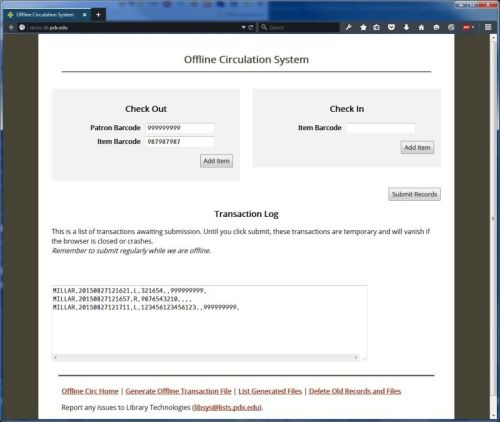
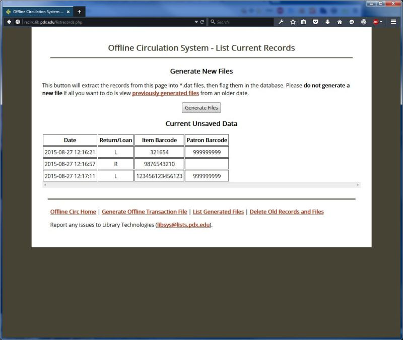
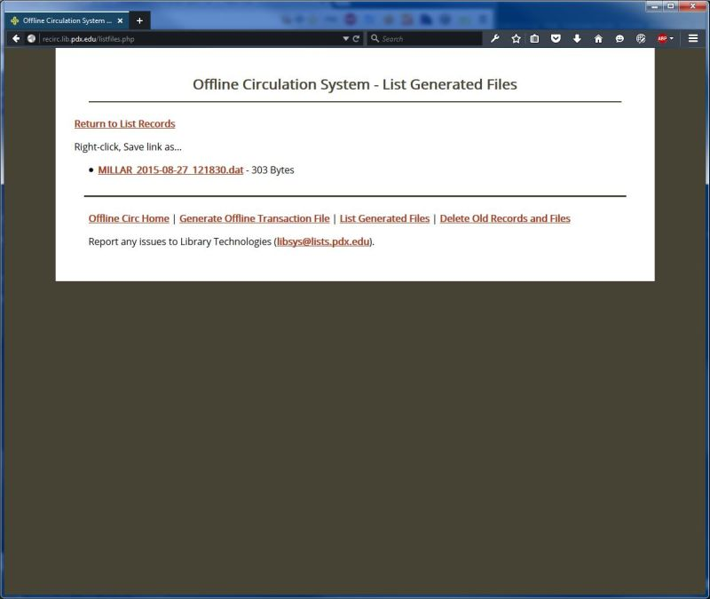

# Alma Offline Circulation Tool

The offline circulation tool provided by Ex Libris functions best on a single circ station. Reconciling the transaction files generated by multiple circ stations can be difficult. For example, if an item is checked in on one station, then checked out on another, but the offline files are uploaded in the opposite order, errors occur.

While thinking about writing software to merge multiple offline circulation files for upload, it was decided that a central system would meet our library's needs better. We searched GitHub for ideas, and found that the University of Oregon Libraries had published a very simple web-based system for this function with a Creative Commons Public Domain license. After forking the source we customized it to better fit our library's environment.

 * Changed the color scheme  
 * Reworded several labels for clarity  
 * Limited checkin / checkout to a single circulation desk  
 * Removed time limits from the purge old files and records process  
 * Corrected several of the database fields types   
 * Added a MySQLdump file containing the database schema for quick provisioning  

The results have been pushed to the [PSU Library's Github](https://github.com/pdxlibrary/alma-offline-circulation-tool).

## How It Works

 * A web server hosts the interface and the database where transactions are centrally stored.  
 * In the event of an Alma outage, the circulation staff access the web site and use it to record transactions.  

     
 * After the outage is over, one staff member uses the web system to generate a transaction file, which is then uploaded to Alma.  

     

     

## Our Environment and Assumptions

 * The offline circ server is online.
 * Library building's network is available (switches are on UPS, internal traffic will flow as long as there is power to the workstations).
 * All workstations that access offline circ have entries in their hosts file (/etc/hosts or c:\windows\system32\drivers\etc\hosts) for the offline circ app server, in case DNS is unavailable.

## Software Description

 * Basic collection of PHP scripts.
 * Requires a LAMP webserver with the php-mysqli package.
 * Server backups are unnecessary. Data are single-use.
 * Web server account has write access to somewhere in the server's filesystem.
 * Site is not accessible outside the library. There is no security built into this app, so the server's configuration is all that prevents outside parties from adding data.

## Installation
 
 * Copy the files into the site.
 
    ```
    [libsys@recirc$] https://github.com/pdxlibrary/alma-offline-circulation-tool.git /var/www/html/offline-circ
    ```

 * Set permissions where the transaction files will be written.

    ```
    [libsys@recirc$] sudo chown apache /var/www/html/offline-circ/output
    ```

 * Install the database. 
 
    ```
    mysql> create database alma_offline;  
    mysql> grant all privileges on alma_offline.* to offline_user identified by 'offline_pass';  
    mysql> flush privileges;  
    mysql> exit;  
    [user@recirc$] mysql -u offline_user -poffline_pass alma_offline < include/alma_offline.sql  
    ```

 * Copy the configuration file into place. 
 
    ```
    [libsys@recirc$] cp include/configuration_sample.php include/configuration.php  
    ```  

 * Configure the app.

    ```
    #!php

    <?php
        $MAIN_TITLE    = 'Offline Circulation System';  
        $CONTACT_NAME  = 'Library Technologies Team';  
        $CONTACT_EMAIL = 'libsys@lists.pdx.edu';  
        $FOOTER_TEXT   = 'Report any issues to $CONTACT_NAME (<a href="mailto:$CONTACT_EMAIL">$CONTACT_EMAIL</a>).';  
 
        $LIBRARIES_ARRAY = array(  
            '---' => 'Choose a Library',  
            'MILLAR' => 'Millar Library',  
            'AVS'    => 'AV Services',  
        );  
   
        $DB_SERVER   = 'localhost';  
        $DB_USERNAME = 'offline_user';  
        $DB_PASSWORD = 'offline_pass';  
        $DB_NAME     = 'alma_offline';  
        $DB_TABLE    = 'transactions';  
        ?> 
    ```


 * Limit access to this site in the web server's configuration.